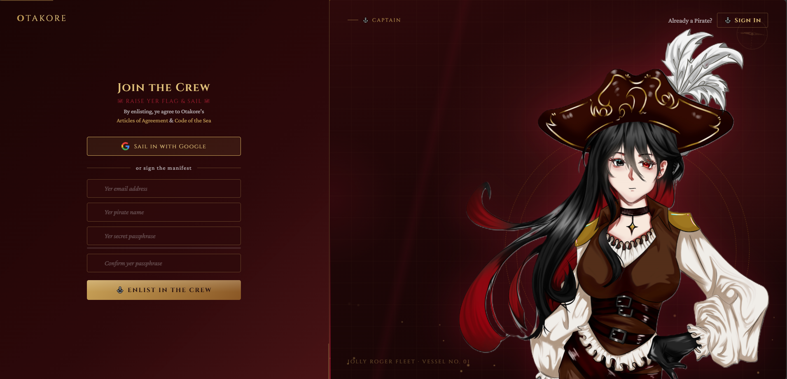

# Otakore — Anime Pirate Authentication UI

A unique anime pirate-themed authentication UI built with pure HTML, CSS, and vanilla JavaScript.

Designed for developers who want a stylish login and signup experience for anime communities, game projects, or creative web apps.

No frameworks. No dependencies. Just plug and play.

---

## Preview

<p align="center">
  
</p>

---

## Features

* Pirate-themed anime authentication UI
* Sign Up form with real-time validation
* Password strength meter with themed feedback
* Sign In modal window
* Google OAuth button (UI ready)
* Toast notification system
* Ripple button interaction effects
* Animated particle background
* Mouse-tracking glow effect
* Responsive layout structure

---

## Tech Stack

HTML5
CSS3 (animations, variables, flex/grid)
Vanilla JavaScript (ES6)

Fonts:
Cinzel
Crimson Pro

No frameworks required.

---

## File Structure

```
otakore-auth-ui
 ├ assets
 │   └ kaishi_pict.png
 │
 ├ css
 │   ├ style.css
 │   └ responsive.css
 │
 ├ js
 │   └ script.js
 │
 ├ index.html
 └ README.md
```

---

## Quick Start

1. Download or extract the template files.

2. Replace the character image inside:

```
assets/kaishi_pict.png
```

3. Open the file:

```
index.html
```

in your browser.

That's it — the template will run instantly.

No installation required.

---

## Customization Guide

### Change Character Image

Open `index.html` and locate:

```

```

Replace the image path with your own asset.

Example:

```

```

---

### Change Brand Name

Find the following in `index.html`:

```
<title>Otakore</title>
```

and

```
<div class="logo">OTAKORE</div>
```

Replace with your project or product name.

---

### Change Theme Colors

Open:

```
css/style.css
```

At the top of the file you will find CSS variables:

```
:root {
  --primary-color: ...
  --accent-color: ...
  --background-color: ...
}
```

Modify these values to customize the color theme.

---

### Change Text Content

Inside `index.html`, you can edit:

* heading text
* form labels
* button text
* descriptive copy

Example:

```
<h1 class="heading">Join the Crew</h1>
```

---

### Adjust Particle Animation

Open:

```
js/script.js
```

Find:

```
for (let i = 0; i < 28; i++)
```

Change the number to increase or reduce particle density.

Example:

```
for (let i = 0; i < 40; i++)
```

---

## Backend Integration

This template simulates requests using `setTimeout()`.

To connect a real backend:

| Action       | Where to modify                                |
| ------------ | ---------------------------------------------- |
| Sign Up      | Replace logic inside `signupBtn` click handler |
| Sign In      | Replace logic inside `signinBtn` handler       |
| Google Login | Replace `googleBtn` event with OAuth redirect  |

You can integrate with:

* Firebase Auth
* Supabase
* Node.js APIs
* Laravel backend
* Django backend

---

## Use Cases

Perfect for:

* Anime community websites
* Game login screens
* Fan projects
* Event landing pages
* Creative portfolio projects

---

## License

MIT License.

Use it, modify it, and integrate it into your own project.
